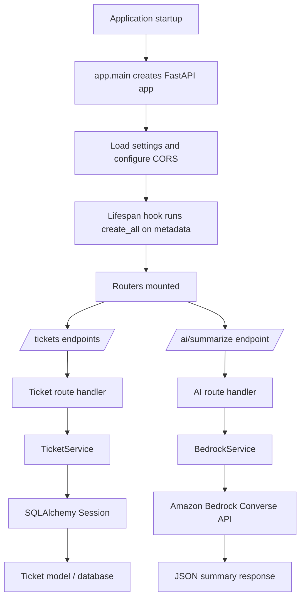

# AI Service Desk Workflow Report

## Overview

This application is a FastAPI-based ticket management service with two main flows:

1. Ticket CRUD and query operations backed by SQLAlchemy and SQLite/PostgreSQL-compatible models.
2. An AI summarization endpoint that sends ticket text to Amazon Bedrock and returns a structured summary plus a suggested response.

At startup, the app initializes the database schema, registers API routers, and exposes health and root endpoints.

## High-Level Request Flow

## Startup Workflow

The application entrypoint is `uvicorn app.main:app`. On startup, FastAPI builds the app in `app/main.py`, loads configuration from `app/core/config.py`, and registers middleware and routers.

The lifespan hook calls `Base.metadata.create_all(bind=engine)` so the database tables are created automatically when the app starts. The engine and session factory are defined in `app/core/database.py`.

The app also exposes:

- `/` for a basic status message
- `/health` for a database health check

## Ticket Workflow

### 1. Create Ticket

Request flow:

1. Client sends `POST /tickets` with a `TicketCreate` payload.
2. `app/api/ticket_routes.py` receives the request and forwards it to `ticket_service.create_ticket()`.
3. `app/services/ticket_service.py` converts `isOpen` into a ticket status.
4. A new `Ticket` model instance is created and persisted with SQLAlchemy.
5. The route returns the new ticket ID and a 201-style status payload.

Relevant inputs and mapping:

- `TicketCreate` in `app/schemas/ticket_schema.py`
- `Ticket` model in `app/models/ticket.py`
- `TicketService.create_ticket()` in `app/services/ticket_service.py`

### 2. List Tickets

Request flow:

1. Client sends `GET /tickets` or `GET /tickets/get_tickets`.
2. Optional query filters are mapped to `TicketStatus`, `TicketPriority`, or legacy `isOpen` handling.
3. The route delegates to `TicketService.get_all_tickets()`.
4. SQLAlchemy builds a filtered query and sorts results by `created_at` descending.
5. The response is serialized with `TicketResponse`.

The application supports both the modern direct route and a legacy route that can return either a single ticket by ID or a filtered collection.

### 3. Get Ticket by ID

Request flow:

1. Client sends `GET /tickets/{ticket_id}`.
2. The route converts the path parameter to a UUID.
3. `TicketService.get_ticket_by_id()` reads the record from the database.
4. If found, the ticket is returned as a `TicketResponse`; otherwise FastAPI raises a 404 error.

The legacy `GET /tickets/get_tickets?ticket_id=...` path follows the same database lookup but wraps the response in a custom envelope.

### 4. Update Ticket

Request flow:

1. Client sends `PUT /tickets/{ticket_id}` or the legacy `PUT /tickets/update` route.
2. The request body is parsed as `TicketUpdate`.
3. `TicketService.update_ticket()` loads the existing record.
4. Only provided fields are applied.
5. `isOpen`, if present, is translated into a `TicketStatus` value.
6. `updated_at` is refreshed and the record is committed.

### 5. Delete Ticket

Request flow:

1. Client sends `DELETE /tickets/{ticket_id}` or the legacy `DELETE /tickets/delete` route.
2. `TicketService.delete_ticket()` loads the record.
3. If present, the ticket is deleted and the transaction is committed.
4. The API returns a confirmation payload or a 404 if the ticket does not exist.

## Data Model Workflow

The core persistence model is `Ticket` in `app/models/ticket.py`.

Key characteristics:

- Primary key: UUID
- Title and description fields for the support issue
- Priority enum: low, medium, high, critical
- Status enum: open, in_progress, resolved, closed
- Timestamp fields for creation and updates
- `deleted_at` is still present in the model definition, although the repository includes a migration named `removed_deleted_at`

The schema layer in `app/schemas/ticket_schema.py` defines:

- `TicketCreate` for incoming create requests
- `TicketUpdate` for partial updates
- `TicketResponse` for API output
- `DeleteTicketResponse` for delete confirmations
- `SummarizeRequest` and `SummarizeResponse` for the AI path

## AI Summarization Workflow

### Endpoint Flow

1. Client sends `POST /ai/summarize` with a ticket description.
2. `app/api/ai.py` instantiates `BedrockService`.
3. `BedrockService.summarize_ticket()` renders the prompt template from `TICKET_SUMMARY_V1`.
4. The prompt is sent to Amazon Bedrock Converse through boto3.
5. The response is expected to contain JSON with:
   - `summary`
   - `suggested_response`
6. The service strips code fences if needed, parses the JSON, and returns the structured payload.

### Fallback and Error Handling

`app/services/bedrock_services.py` also defines `FakeBedrockService`, which produces a deterministic offline response. The live route currently uses the real `BedrockService` directly.

If Bedrock fails or returns invalid content, the service raises `BedrockServiceError`.

## Test Workflow

The repository is covered by unit, integration, and end-to-end tests.

### Test Setup

`tests/conftest.py` prepares the environment before application import, which is important because settings are loaded during app startup.

Per the repository notes, tests override `get_db` with a temporary SQLite database rather than mocking the service layer.

### Coverage

- Unit tests cover create, list, get, update, and delete behavior.
- Integration tests verify route-to-database behavior for ticket creation and retrieval/update flows.
- End-to-end tests exercise the full lifecycle: create, get, update, delete.

## Complete End-to-End Workflow

A typical user journey looks like this:

1. The app starts with Uvicorn and initializes the database schema.
2. The client submits a new ticket through `/tickets`.
3. The request is validated by Pydantic schemas.
4. The route forwards the request to the ticket service.
5. The service writes the record to the database.
6. The client reads or filters tickets through the list and lookup endpoints.
7. The client updates ticket fields, including open/closed state.
8. The client deletes the ticket when the issue is resolved.
9. If the user wants AI assistance, they send ticket text to `/ai/summarize`.
10. The AI service returns a summary and suggested response based on the Bedrock model output.

## Files Used For This Report

- `app/main.py`
- `app/api/ticket_routes.py`
- `app/api/ai.py`
- `app/services/ticket_service.py`
- `app/services/bedrock_services.py`
- `app/services/prompt_templates.py`
- `app/models/ticket.py`
- `app/schemas/ticket_schema.py`
- `app/core/database.py`
- `app/core/config.py`
- `tests/conftest.py`
- `tests/unit/`
- `tests/integration_test/`
- `tests/end_to_end_test/`

## Notes

- The `/health` route in `app/main.py` depends on a SQL text helper that is not imported in the snippet reviewed, so that endpoint may fail at runtime unless the missing import exists elsewhere or is added later.
- The ticket APIs expose both modern REST-style paths and older legacy routes, which suggests a compatibility layer for older clients.
- The app is currently structured around synchronous SQLAlchemy sessions for ticket operations.
